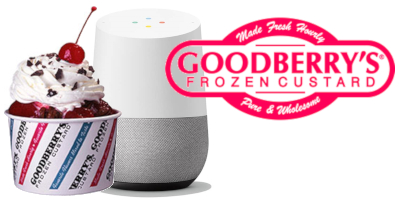

I love [Goodberry's Frozen Custard](http://www.goodberrys.com/). My wife loves it even more. And when she is pregnant, her love exceeds all bounds. But whether we go to Goodberrys any given day is highly dependent on the current specialy flavor. And pulling out our phones, finding the non-mobile friendly Goodberrys website, pinch-zooming in on the flavor of the day calendar, and trying to remember the current date is just exhausting! :)

Now I just have to tell my phone or my speaker "Hey Google, talk to Goodberry Flavor!" and ask it:

- What is the flavor today?
- What is the flavor tomorrow?
- What is the flavor on October 30?
- What was te flavor on February 2nd?

This was my first attempt at creating a Google Assistant action. Also my first time using Firebase. Also, one of my first ventures into Node.js (as you can probably tell by the long JS dictionary in the code) :)
